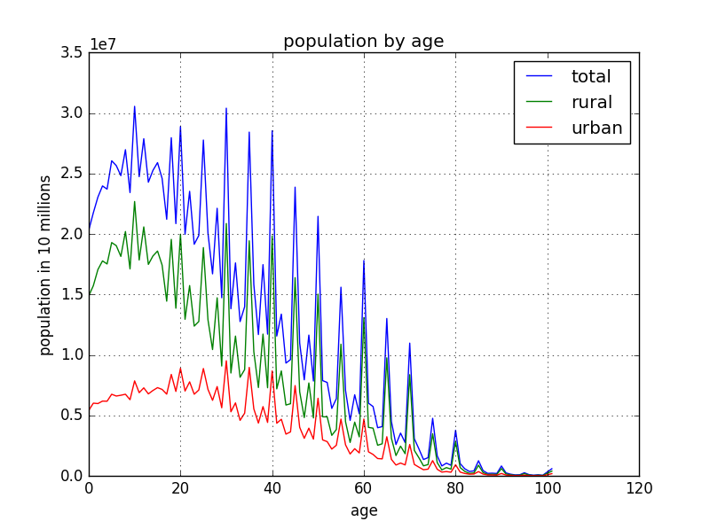
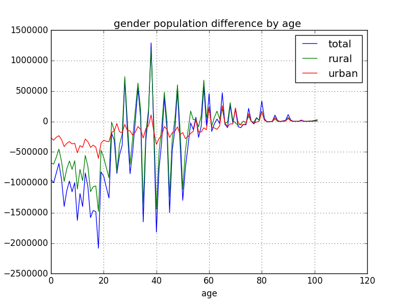
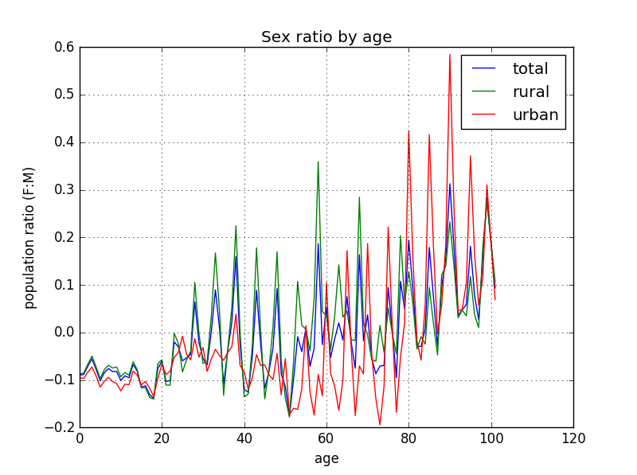

# Indian Population
Analysis of census data of indian population

The data used for this exxample is taken from [Census of India](http://censusindia.gov.in/).

The particular sheet used for this example can be found [here](http://www.censusindia.gov.in/2011census/C-series/C-13.html), under __C-13__ column and __India__ row

Or

You can download it directly from [here](http://www.censusindia.gov.in/2011census/C-series/c-13/DDW-0000C-13.xls)

## Plots

#### Population plot by age

#### Geneder Population difference plot by age ( Female - Male )

#### Sex ratio plot by age

